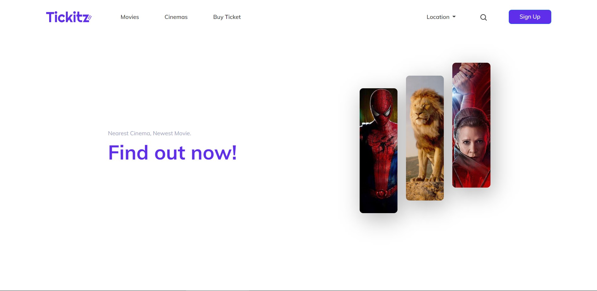
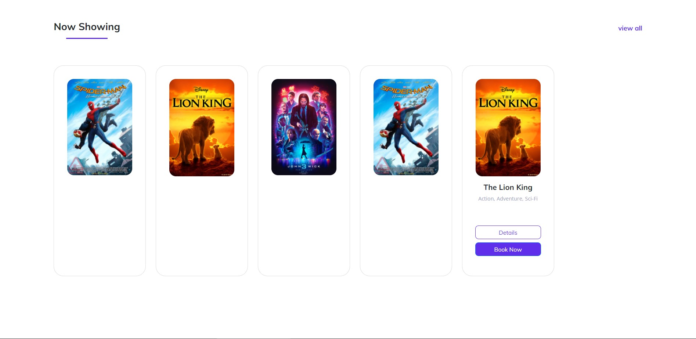

<h1 align='center'>Uvies - Movie Ticket Booking Online</h1>
  

    <a href="https://tickitz-ticket.netlify.app/">View Demo</a>
    ·
    <a href="https://github.com/twicks95/tickitz-web-responsive/issues">Report Bug</a>
    ·
    <a href="https://github.com/twicks95/tickitz-web-responsive/pulls">Request Feature</a>
  

## About The Project

The website application was created to help movie lovers to find out what films are currently showing and will be showing in the near future. It also provides the convenience of choosing a cinema, booking seats, and buying tickets online.

## Built With

## Getting Started

1. Download this Project or you can type `git clone https://github.com/twicks95/Tickitz-Ticket-Booking-Website.git`
2. Open app's directory with your browser

## License

© [Teguh Wicaksono](https://github.com/twicks95/)